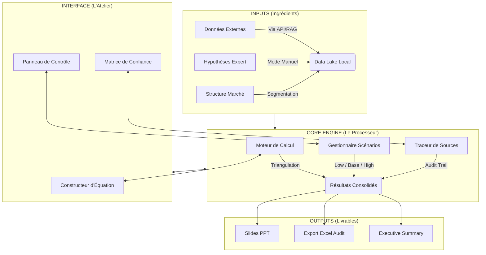

# Plan de Conception : Module d'Estimation de Taille de Marché ("The Market Sizer")

> **Rôle** : Architecte Produit Senior
> **Cible** : Consultants en stratégie, Managers, Partners
> **Objectif** : Produire des estimations de marché défendables pour des marchés opaques.

---

## 1. Schéma Fonctionnel Global

Le module "Market Sizer" agit comme un **moteur de raisonnement structuré**. Il ne produit pas la donnée (rôle du RAG/Scraping) mais il l'organise pour transformer des points de données épars en une conviction auditable.

### Architecture Logique

### Flux de Travail (Workflow)
1.  **Définition** : L'utilisateur définit la structure du marché (ex: Volumétrie x Prix).
2.  **Alimentation** : Injection des hypothèses (manuelle ou suggérée par RAG).
3.  **Triangulation** : Création de méthodes alternatives (Top-down vs Bottom-up).
4.  **Raffinage** : Ajustement des sensibilités et scénarios.
5.  **Restitution** : Génération des graphiques finaux.

---

## 2. Modèle Visuel Détaillé

L'interface est divisée en 3 zones principales pour maximiser la clarté cognitive ("Cognitive Load Management").

### Zone A : La Toile de Raisonnement (Centre - 60%)
C'est l'espace de travail principal. Il ne ressemble pas à Excel, mais à un arbre logique interactif.

*   **Composant Visuel** : **Arbre de Valeur (Value Driver Tree)**.
    *   Racine : Taille du Marché (Value).
    *   Branches : Volume x Prix Moyen.
    *   Sous-branches : (Population x Pénétration) x (Prix Unitaire x Fréquence).
*   **Interaction** :
    *   Chaque nœud est une "Carte".
    *   Clic sur une carte = ouvre le détail dans la Zone B.
    *   Drag & Drop pour changer la structure de l'équation.

### Zone B : Le Panneau d'Hypothèses (Droite - 25%)
Contextuel au nœud sélectionné dans la Zone A.

*   **Sélecteur de Valeur** :
    *   Input numérique simple.
    *   **Slider de Confiance** : "Niveau de certitude" (Low/High).
    *   **Sélecteur de Range** : Définition des bornes Pessimiste / Optimiste.
*   **Justification & Sources** :
    *   Champ texte "Raisonnement de l'hypothèse".
    *   Badge "Source" : [Lien vers Doc] ou [Tag: Expert Interview].
    *   Indicateur de fraîcheur : "Date de la donnée : 2023".

### Zone C : Le Cockpit de Comparaison (Bas - 15%)
Toujours visible. Barre de navigation de la triangulation.

*   **Onglets Méthodes** : [Méthode 1: Demande (Top-Down)] | [Méthode 2: Offre (Bottom-Up)] | [Méthode 3: Analogues].
*   **Mini-Waterfall** : Visualisation immédiate de l'écart entre les méthodes.
*   **Bouton Consolidations** : "Créer le Consensus" (Moyenne pondérée des méthodes).

---

## 3. Fonctionnalités Clés

### 1. Gestion Multi-Scénarios & Sensibilité
*   Chaque variable possède nativement 3 états : `Low`, `Base`, `High`.
*   Un **Master Switch** permet de basculer tout le modèle d'un scénario à l'autre instantanément.
*   **Sensitivity Tornado** : Une fonctionnalité analyse automatiquent quelles variables ont le plus d'impact sur le résultat final (ex: "Attention, une variation de 1% du prix change le résultat de 10%").

### 2. Triangulation Native
*   Le système force l'utilisateur à ne pas se fier à un seul chiffre.
*   Possibilité de cloner une estimation pour changer l'approche (ex: "Dupliquer en méthode Bottom-Up").
*   Affichage "Football Field" : Comparaison visuelle des barres d'erreur de chaque méthode pour voir si elles se chevauchent (zone de confiance).

### 3. Auditabilité (Traceability)
*   **Mode "Partner Review"** : Un filtre visuel qui cache les détails et surligne en ROUGE les hypothèses :
    *   À faible confiance.
    *   À fort impact.
    *   Sans source citée.
*   Permet au manager de challenger uniquement ce qui compte en 2 minutes.

---

## 4. Outputs Standards (Slide-Ready)

Les sorties sont conçues pour être copiées-collées directement dans un deck client.

### Output 1 : La Cascade de Marché (Market Sizing Waterfall)
*   **Type** : Graphique Waterfall (Pont).
*   **Contenu** : Part du marché Total Adressable (TAM) -> Serviceable (SAM) -> Serviceable Obtainable (SOM).
*   **Usage** : Montrer le potentiel réaliste vs théorique.

### Output 2 : Le Terrain de Football (Valuation Football Field)
*   **Type** : Barres horizontales flottantes (Min-Max).
*   **Contenu** : Une barre par méthode d'estimation. Une ligne verticale "Consensus" (moyenne choisie).
*   **Usage** : Démontrer la robustesse par la convergence des méthodes.

### Output 3 : La Matrice des Hypothèses Clés
*   **Type** : Tableau stylisé.
*   **Colonnes** : Variable | Valeur (Range) | Source | Impact (High/Med/Low).
*   **Usage** : Annexe technique obligatoire pour valider les chiffres.

### Output 4 : Texte de Synthèse Généré
*   **Format** : Paragraphe rédigé.
*   **Exemple** : *"Le marché est estimé entre X et Y M€ (Cas de base : Z M€), tiré principalement par [Driver A]. Cette estimation repose sur une approche croisée Demande/Offre, avec une convergence forte sur le segment [Segment]. La principale incertitude réside dans [Variable risquée]."*

---

## 5. Synthèse des Contraintes & Approche Consultant

| Contrainte | Solution Design |
| :--- | :--- |
| **Peu de données** | Focus sur la structure logique et les fourchettes (ranges) plutôt que la précision pointue. |
| **Opacité** | Utilisation explicite de "Proxies" (marchés analogues) comme méthode de validation. |
| **Auditabilité** | Chaque chiffre a une métadonnée "Source" et "Confiance". Rien n'est "magique". |
| **Rapidité** | Templates pré-remplis (Arbre classique Volume x Prix) pour ne pas partir de zéro. |

Ce modèle répond au besoin de **rigueur dans l'incertitude**, typique des missions de due diligence stratégique.
